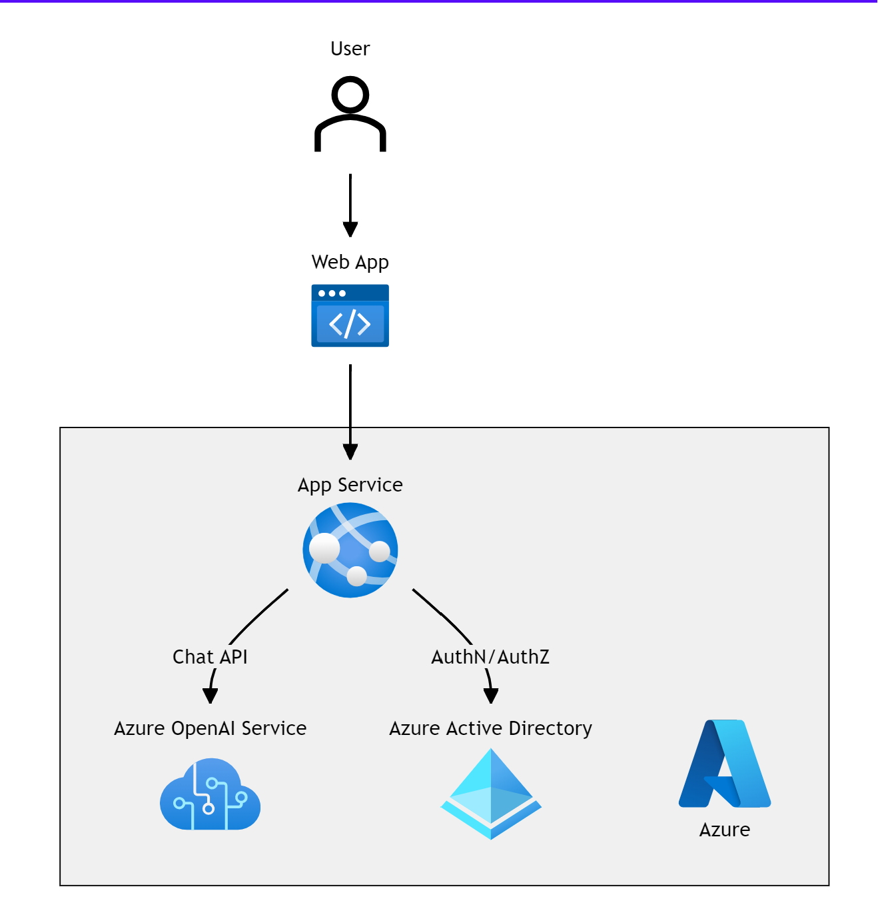

⚠️⚠️ This repo is no longer maintained. The code may be useful for reference purposes, but if you want to deploy a custom Chat GPT on Azure, look for official projects from Microsoft. 

# Chat GPT on Azure

Front end and middleware for Azure OpenAI Service.

To deploy this you will need: 

- An Azure account
- A GitHub account
- Access to create an Azure OpenAI resource, or access to an OpenAI API

This is a personal project: it is not endorsed by Microsoft, OpenAI, my employer, or anyone else!

# Architecture

Frontend: Azure Static Web Apps with python middleware

Backend: Either an Azure OpenAI resource or OpenAI API

Auth: Static Web Apps user management

# Deployment

To deploy this app: 

1. Run one of the Azure templates below
1. Fork the GitHub repo and deploy the app using GitHub Actions
1. Grant users access 

## Azure Templates

There are three deployment options based on the type of GPT backend you want to use. Choose one of the 'Deploy to Azure' options:

| Backend                    | Deploy to Azure                                                                                                                                                                                                                               | Pre-requisites                                                                                     |
| ---                         | ---                                                                                                                                                                                                                                           | ---                                                                                                |
| New Azure OAI resource      |       | Ability to create an Azure OpenAI resource: https://aka.ms/oai/access                              |
| Existing Azure OAI resource |  | API Endpoint and Key to an existing Azure OpenAI resource. The resource owner should provide these |
| OpenAI's API                |     | An [OpenAI API key](https://platform.openai.com/account/api-keys)                                  |

At the time of writing, to deploy an Azure OpenAI resource, access must be requested at https://aka.ms/oai/access . Once Microsoft has granted access, you will be able to deploy the AzureOpenAI template. 

If you are using an existing Azure OpenAI resource, you will need the API endpoint, API key, and the name of the deployed model within the resource. The owner of the resource should provide you with these (see section below for how to find these details from an existing Azure OpenAI Service resource). The resource will also need to allow network access from Azure Static Web apps (see below).

### Template Parameters

You'll need to select Resource Group, Region at a minimum. If using an existing backend you can provide the API key at deployment time or later.

|||
|---|---|
|Resource Group |Resource Group is like a folder in your Azure account that will contain the app. Give it a name you'll recognise, so you can search for it later. |
|Region |Region specifies which data centers host your app, if you're not sure, pick the one closest to you. |
|SKU |The pricing plan for the Azure resources (see Azure pricing links below). Static Web App has a free plan for personal apps. |
|Endpoint, Endpoint Key, Model Deployment Name |If you're not creating a new Azure OpenAI resource, you'll need to provide an API endpoint, key and deployment name to an existing one. The owner of the Azure OpenAI resource should provide these.|

- [Azure Static Web App pricing](https://azure.microsoft.com/en-gb/pricing/details/app-service/static/)
- [Azure OpenAI Service pricing](https://azure.microsoft.com/en-gb/pricing/details/cognitive-services/openai-service/)
- [Plan and manage costs in Azure OpenAI Service](https://learn.microsoft.com/en-us/azure/ai-services/openai/how-to/manage-costs)

### Azure OpenAI Service Endpoint and API Keys

You can find the endpoint and API Keys for the OpenAI resource in the Azure Portal, under the Endpoint and Keys in the left hand menu of the resource

Navigate to the Azure OpenAI studio to deploy or view deployed models. The Deployment Name for a model is required to make API calls to that model.

[Microsoft Learn - Deploy a Model](https://learn.microsoft.com/en-us/azure/ai-services/openai/how-to/create-resource?pivots=web-portal#deploy-a-model)

## Navigate to your app in the Azure Portal

Once the template deployment has finished, click 'Go to Resource Group' to manage the deployed resources. 

Alternatively, use the Azure Portal search bar to search for 'Static Web App' or the name of your Resource Group.

## Web app deployment with GitHub Actions

Once the Azure Templates have successfully completed, you'll need to deploy the app using GitHub Actions (or Azure DevOps).

1. To use GitHub actions, [fork this repository](https://github.com/stu-bell/chatgpt-on-azure/fork) and set up GitHub actions.

2. In the [Azure Portal](https://portal.azure.com), locate the Static Web App resource created by the templates. On the overview page, click Manage Deployment Token, and copy the token. [Microsoft Learn - Static Web App Deploymet Token](https://learn.microsoft.com/en-us/azure/static-web-apps/static-web-apps-cli-deploy#deployment-token)

3. Save the deployment token in GitHub as a secret: In your fork of the repo, go to settings > Secrets and Variables > Actions. Create a new secret called `DEPLOY_TOKEN` and paste the token you copied from the Static Web App in the previous step. [More details on creating GitHub secrets](https://docs.github.com/en/actions/security-guides/using-secrets-in-github-actions#creating-secrets-for-a-repository)
4. In your fork of the repo, go to Actions > Enable Workflow for this Fork.
5. From the left panel, select the workflow named 'Azure Static Web Apps CI/CD' > Run workflow
6. Once the deployment has completed, in the Static Web App Azure Portal page, find the web app's URL (#2 in the screenshot below).

Open this URL in your browser and you should be presented with the webapp's login page. To add yourself as a user to the webapp, see section below on managing user access.

If you prefer to deploy using Azure DevOps pipelines, use the azure-pipelines.yml file and save the deployment token as a secret pipeline variable called `DEPLOY_TOKEN`.

# Manage user access

Before you can use the app, you'll need to invite users (including yourself).

If you have a small number of users, you can manually invite users from the Azure Portal. Users will need to click the invite links to sign up:

[Manually invite users](https://learn.microsoft.com/en-us/azure/static-web-apps/authentication-custom?tabs=aad%2Cinvitations#manage-roles)

The app config assumes you'll send app user invites with a custom role called `invited`. This will only allow users you've explicitly invited to use the app. 

If you wish to automate role assignments, rather than manually sending invites, implement an Azure Function to assign the 'invited' role to users that are allowed to use the app. [Manage Roles with an Azure Function](https://learn.microsoft.com/en-us/azure/static-web-apps/authentication-custom?tabs=aad%2Cfunction#manage-roles)

To restrict the app to members of your AAD tenant, or a specific group of users in your tenant, see the docs for configuring [Custom Authentication](https://learn.microsoft.com/en-us/azure/static-web-apps/authentication-custom?tabs=aad%2Cfunction#configure-a-custom-identity-provider)

# Add IP restrictions to your Static Web App

To restrict access to the Static Web App, (for example, to your users' VPN), modify `staticwebapp.config.json` > networking > allowedIpRanges. See the [Static Web App Networking docs](https://learn.microsoft.com/en-us/azure/static-web-apps/configuration#networking) for more info.

> Note that Static Web App network restrictions are only available on the Standard plan.
# Add IP restrictions to the Azure OpenAI service

To add network restrictions to your OpenAI resource, you'll need to know from which IP ranges your Static Web App will make requests. At the time of writing, Static Web Apps doesn't give us a way to easily find which possible IP address it might use. We can restrict access Azure IP addresses in the webapp's region. While this is still a huge range, it's better than allowing public access from the internet. If you need stronger network restrictions, checkout [this article](https://techcommunity.microsoft.com/t5/apps-on-azure-blog/integrating-network-isolated-backends-with-azure-static-web-apps/ba-p/3721136) to integrate your Static Web App with a VNet via API Management.

Restrict OpenAI resource to the region of your Static Web App:

1. Download the list of Azure IP addresses from [this page](https://www.microsoft.com/en-us/download/details.aspx?id=56519) (updated weekly)
2. Search for the entry for `AzureCloud.`
3. Copy the array of IP address. Remove all ranges that aren't IPv4 format (eg remove all the ranges in this longer format: "2806:1010:4:802::148/125")
4. Add this list of IP addresses to the allow list of the Azure OpenAI resource. Since it's a large list, you may want to use the ARM template, with the array of IP addresses in the allowedIPAddresses parameter. 

If anyone is aware of a better way of doing this - please let me know via GitHub issues!

## Updating API keys or endpoints

In the Azure Portal, under the Keys and Endpoint menu of your Open AI resource, copy Key 1 and the Endpoint. In the Azure Open AI Studio, make a note of the model you have deployed.

In the Azure Portal, under the Configuration menu of your static web app resource, add the following application settings, replacing the values. Click Update. 

# Develop and build

## Front end

Requires [node](https://nodejs.org/)

`cd webapp`

`npm install`

Start mock static server for front end dev (run in a separate shell session to npm run start): `npm run mock` 

> Don't run the mock server at the same time as running the Azure Functions locally. Choose one or the other. Mock server is for serving static responses, while Azure Functions runs a local version of the API functions. 

Start the front end server: `npm run start`

## Backend 

To run locally, requires [python](https://python.org/) and [Azure Functions Core Tools](https://learn.microsoft.com/en-us/azure/azure-functions/functions-run-local?tabs=windows%2Cisolated-process%2Cnode-v4%2Cpython-v2%2Cv2%2Chttp-trigger%2Ccontainer-apps&pivots=programming-language-python)

You'll need to configure [local.settings.json](https://learn.microsoft.com/en-us/azure/azure-functions/functions-develop-local#local-settings-file) and run the functions locally using Azure Function Core tools. See local.settings.json.example for the values required.

> Don't run the mock server at the same time as running the Azure Functions locally. Choose one or the other. Mock server is for serving static responses, while Azure Functions runs a local version of the API functions. 

`cd webapp/api`

`pip install -r requirements.txt`

`func start`

The default localhost port is 7071. If you need a different port, set LOCAL_FUNCTIONS_PORT=<port>.

[Python Azure Functions...](https://learn.microsoft.com/en-us/azure/azure-functions/create-first-function-vs-code-python?pivots=python-mode-decorators)

## API Tests

Install pytest: `pip install -r requirements-dev.txt`.

From the `webapp/api` directory, run `pytest tests/unit`

To run integration tests, you'll need to use the Azure Function Core Tools (see above).

Run the functions locally: `func start` and then run the tests: `pytest tests/integration`. 

# Microsoft Learn

[Deploy to Azure Static Web Apps](https://learn.microsoft.com/en-gb/azure/static-web-apps/get-started-portal?tabs=vanilla-javascript&pivots=github) using GitHub Actions or Azure DevOps Pipelines

[Azure OpenAI Service](https://learn.microsoft.com/en-us/azure/ai-services/openai/chatgpt-quickstart?tabs=command-line&pivots=programming-language-python)
