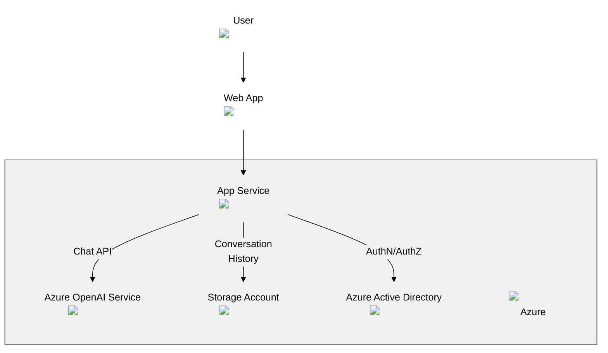

```mermaid
flowchart TB;

user-->swa-->appservice
subgraph azure[ ]
appservice-->|Chat API|oai
appservice-->|Conversation \nHistory|stg
appservice-->|AuthN/AuthZ|aad
azlogo
end

user["User
<div style='width:80px;display:flex;justify-content:center;'>
<img src='https://raw.githubusercontent.com/stu0292/azure-logos/main/user.svg'>"]

swa["Web App
<div style='display:flex;justify-content:center;'>
<img style='max-width:80px' src='https://raw.githubusercontent.com/stu0292/azure-logos/main/static-web-apps.svg'>"]

appservice["App Service
<div style='display:flex;justify-content:center;'>
<img style='max-width:80px' src='https://raw.githubusercontent.com/stu0292/azure-logos/main/app-service.svg'>"]

stg["Storage Account
<div style='display:flex;justify-content:center;'>
<img style='max-width:80px' src='https://raw.githubusercontent.com/stu0292/azure-logos/main/storage-account.svg'>"]

oai["Azure OpenAI Service
<div style='display:flex;justify-content:center;'>
<img style='max-width:80px' src='https://raw.githubusercontent.com/stu0292/azure-logos/main/cognitive-services.svg'>"]

aad["Azure Active Directory
<div style='display:flex;justify-content:center;'>
<img style='max-width:80px' src='https://raw.githubusercontent.com/stu0292/azure-logos/main/azure-active-directory.svg'>"]

azlogo["<div style='width:80px;display:flex;justify-content:center;'>
<img src='https://raw.githubusercontent.com/stu0292/azure-logos/main/azure-logo.svg'></div>Azure"]

classDef node fill:none, color:#000, stroke:none
classDef edgePaths stroke:#000
classDef marker fill:#000, stroke:#000
classDef edgeLabel color:#000, background-color:#f0f0f0
classDef cluster fill:#f0f0f0, stroke:#000
```
